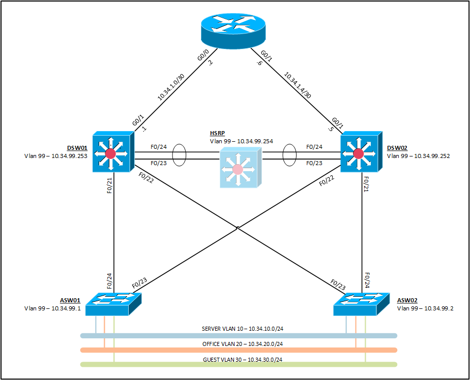

# Example Campus Switched Network

A sample Enterprise Campus 3 Architecture focusing on key switching technologies.

## Network Topology

[]()


### Devices and Interfaces

| Device | Interface | IPv4 Address | IPv6 Address |
| ------ | ------ | ------ |------ |
| RTR01 | GigabitEthernet0/0 | 10.34.1.2/30 |   |
|   | GigabitEthernet0/1 | 10.34.1.6/30 |   |
|   | Loopback0 | 1.1.1.1/32 |   |
| DSW01 | GigabitEthernet0/1 | 10.34.1.1/30 |   |
|   | Vlan99 | 10.34.99.253/24 | 2001:face:be34:99::fd/64 |
|   | Vlan10 | 10.34.10.253/24 | 2001:face:be34:10::fd/64 |
|   | Vlan20 | 10.34.99.253/24 | 2001:face:be34:20::fd/64 |
|   | Vlan30 | 10.34.99.253/24 | 2001:face:be34:30::fd/64 |
| DSW02 | GigabitEthernet0/1 | 10.34.1.5/30 |   |
|   | Vlan99 | 10.34.99.252/24 | 2001:face:be34:99::fc/64 |
|   | Vlan10 | 10.34.10.252/24 | 2001:face:be34:10::fc/64 |
|   | Vlan20 | 10.34.99.252/24 | 2001:face:be34:20::fc/64 |
|   | Vlan30 | 10.34.99.252/24 | 2001:face:be34:30::fc/64 |
| HSRP | Vlan99 | 10.34.99.254/24 | 2001:face:be34:99::fe/64 |
|   | Vlan10 | 10.34.10.254/24 | 2001:face:be34:10::fe/64 |
|   | Vlan20 | 10.34.99.254/24 | 2001:face:be34:20::fe/64 |
|   | Vlan30 | 10.34.99.254/24 | 2001:face:be34:30::fe/64 |

### Vlans

| Vlan | Name | Gateway Address |
| ------ | ------ | ------ |
| 99 | MANAGEMENT | 10.34.99.254 |
| 10 | SERVERS | 10.34.99.254 |
| 20 | OFFICE | 10.34.99.254 |
| 30 | GUEST | 10.34.99.254 |
| 66 | NATIVE |   |
| 999 | UNUSED |   |

## Technologies

* Dual IPv4 and IPv6 SDM Templates
* Type 9 Scrypt password encryption
* SSHv2 Access
* 802.1Q Vlans
* VTPv3
* 802.1W Rapid Spanning Tree
* Etherchannel (LACP)
* Port Security
* DHCP Snooping
* OSPFv2 (IPv4)
* OSPFv3 (IPv6)


### HSRP

DSW01 and DSW02 participate in the HSRP configuration.

DSW01 will be the active router for Vlans 99 and 10, and standby router for Vlans 20 and 30.

DSW02 will be the active router for Vlans 20 and 30, and standby router for Vlans 99 and 10.

<pre>
DSW01# show standby
 <b>Vlan10 - Group 10
  State is Active</b>
   2 state changes, last state change 00:01:36
 Virtual IP address is 10.34.10.254
 Active virtual MAC address is 0000.0c07.ac0a
  Local virtual MAC address is 0000.0c07.ac0a (v1 default)
 Hello time 3 sec, hold time 10 sec
  Next hello sent in 0.560 secs
 Preemption enabled
 Active router is local
 Standby router is 10.34.10.252, priority 100 (expires in 10.704 sec)
 Priority 110 (configured 110)
 Group name is "hsrp-Vl10-10" (default)
 <b>Vlan20 - Group 20
  State is Standby</b>
   2 state changes, last state change 00:01:27
 Virtual IP address is 10.34.20.254
 Active virtual MAC address is 0000.0c07.ac14
  Local virtual MAC address is 0000.0c07.ac14 (v1 default)
 Hello time 3 sec, hold time 10 sec
  Next hello sent in 2.192 secs
 Preemption enabled
 Active router is 172.16.30.2, priority 150 (expires in 9.392 sec)
 Standby router local
 Priority 100 (default 100)
 Group name is "hsrp-Vl20-20" (default)
 --More--
</pre>

### Spanning-Tree

> This section is currently under construction. Sorry about that!

```
DSW01# show spanning-tree
```
## Authors

* **Kristopher Lloyd** - [LinkedIn](https://www.linkedin.com/in/kris-lloyd)
