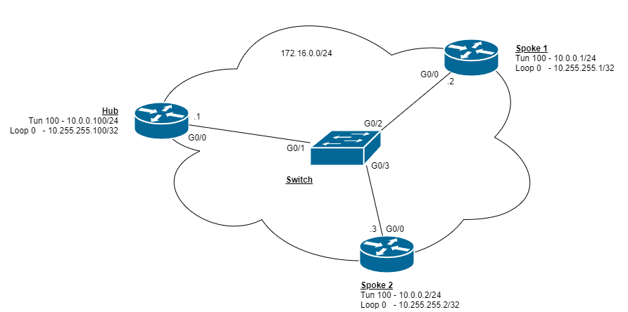

[< Back to Network-Configs](https://github.com/KrisLloyd/Network-Configs/)
***

# DMVPN, IPSec, OSPF

A simple DMVPN topology with IPSec.

## Network Topology

### Devices and Interfaces

| Device | Interface | IPv4 Address |
| ------ | ------ | ------ |
| Hub | GigabitEthernet0/0 | 172.16.0.1/24 | 
|   | Tunnel 100 | 10.0.0.100/24 |
|   | Loopback10 | 10.255.255.100/32 |
| R2 | GigabitEthernet0/0/0 | 172.16.0.2/24 | 
|   | Tunnel 100 | 10.0.0.1/24 |
|   | Loopback10 | 10.255.255.1/32 |
| R3 | GigabitEthernet0/0/0 | 172.16.0.3/24 | 
|   | Tunnel 100 | 10.0.0.2/24 |
|   | Loopback10 | 10.255.255.2/32 |

## Technologies

* OSPF routing
* Type 9 Scrypt password encryption
* SSHv2 Access
* DMVPN
* VRF
* IPSec

### DMVPN

#### DMVPN Phase 1

<pre>
Code output segments here
</pre>

#### DMVPN Phase 2

<pre>
Code output segments here
</pre>

#### IPSec

<pre>
Code output segments here
</pre>

## Author

* **Kristopher Lloyd** - [LinkedIn](https://www.linkedin.com/in/kris-lloyd)
