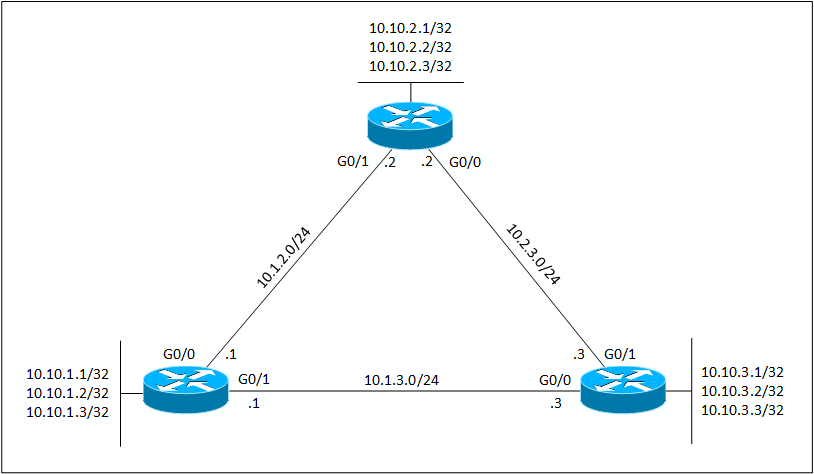

[< Back to Network-Configs](https://github.com/KrisLloyd/Network-Configs/)
***

# EIGRP Network with Load Balancing

A sample EIGRP network with redundant links to leverage load balancing.

## Network Topology

### Devices and Interfaces

| Device | Interface | IPv4 Address |
| ------ | ------ | ------ |
| R1 | GigabitEthernet0/0 | 10.1.2.1/24 | 
|   | GigabitEthernet0/1 | 10.1.3.1/24 |
|   | Loopback11 | 10.10.1.1/32 |
|   | Loopback12 | 10.10.1.2/32 |
|   | Loopback13 | 10.10.1.3/32 |
| R2 | GigabitEthernet0/0 | 10.1.2.2/24 | 
|   | GigabitEthernet0/1 | 10.2.3.2/24 |
|   | Loopback21 | 10.10.2.1/32 |
|   | Loopback22 | 10.10.2.2/32 |
|   | Loopback23 | 10.10.2.3/32 |
| R3 | GigabitEthernet0/0 | 10.1.3.3/24 | 
|   | GigabitEthernet0/1 | 10.2.3.3/24 |
|   | Loopback31 | 10.10.3.1/32 |
|   | Loopback32 | 10.10.3.2/32 |
|   | Loopback33 | 10.10.3.3/32 |

## Technologies

* EIGRP routing
* Type 9 Scrypt password encryption
* SSHv2 Access
* Load Balancing

### EIGRP

> This section is under construction. Sorry about that!

The **show ip eigrp neighbors** command shows that the network has reached convergence and all routers have formed neighbour adjacencies with their neighbours.

<pre>
R1#show ip eigrp neighbors
IP-EIGRP neighbors for process 100
H   Address         Interface      Hold Uptime    SRTT   RTO   Q   Seq
                                   (sec)          (ms)        Cnt  Num
0   10.1.2.2        Gig0/0       13   00:03:11  40     1000  0   15
1   10.1.3.3        Gig0/1       10   00:02:36  40     1000  0   22
</pre>

<pre>
R2#sh ip eigrp neighbors
IP-EIGRP neighbors for process 100
H   Address         Interface      Hold Uptime    SRTT   RTO   Q   Seq
                                   (sec)          (ms)        Cnt  Num
0   10.1.2.1        Gig0/1       12   00:03:44  40     1000  0   21
1   10.2.3.3        Gig0/0       13   00:03:08  40     1000  0   21
</pre>

<pre>
R3#sh ip eigrp neighbors
IP-EIGRP neighbors for process 100
H   Address         Interface      Hold Uptime    SRTT   RTO   Q   Seq
                                   (sec)          (ms)        Cnt  Num
0   10.1.3.1        Gig0/0       12   00:03:39  40     1000  0   22
1   10.2.3.2        Gig0/1       14   00:03:39  40     1000  0   16
</pre>

## Author

* **Kristopher Lloyd** - [LinkedIn](https://www.linkedin.com/in/kris-lloyd)
