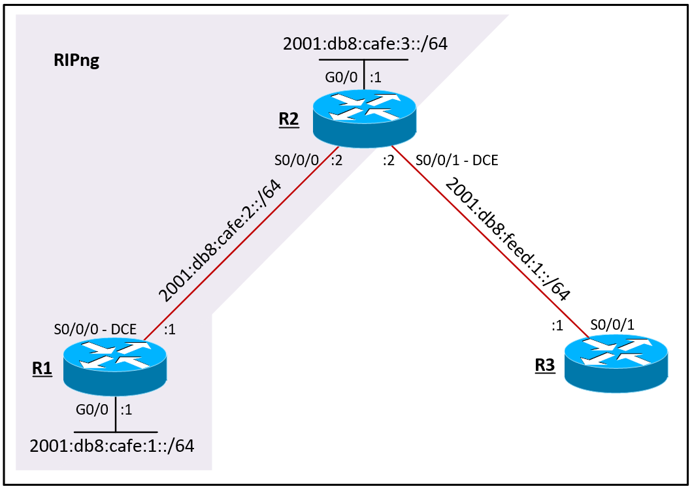

# Example RIPng Network

A sample RIPng network.

## Network Topology

### Devices and Interfaces

| Device | Interface | IPv6 Address Unicast | IPv6 Address Link-Local |
| ------ | ------ | ------ | ------ |
| R1 | GigabitEthernet0/0 | 2001:db8:cafe:1::1/64 | fe80::1 |
|   | Serial0/0/0 | 2001:db8:cafe:2::1/64 | fe80::1 |
| R2 | GigabitEthernet0/0 | 2001:db8:cafe:3::1/64 | fe80::2 |
|   | Serial0/0/0 | 2001:db8:cafe:2::2/64 | fe80::2 |
|   | Serial0/0/1 | 2001:db8:feed:1::2/64 | fe80::2 |
|   | Loopback10 | 2001:db8:cafe:10::2/64 | fe80::2 |
|   | Loopback20 | 2001:db8:cafe:20::2/64 | fe80::2 |
|   | Loopback30 | 2001:db8:cafe:30::2/64 | fe80::2 |
| R3 | Serial0/0/1 | 2001:db8:feed:1::1/64 | fe80::3 |

## Technologies

* IPv6 addressing
* Type 9 Scrypt password encryption
* SSHv2 Access
* RIPng Routing

### RIPng

> This section is currently under construction. Sorry about that!

## Authors

* **Kristopher Lloyd** - [LinkedIn](https://www.linkedin.com/in/kris-lloyd)
